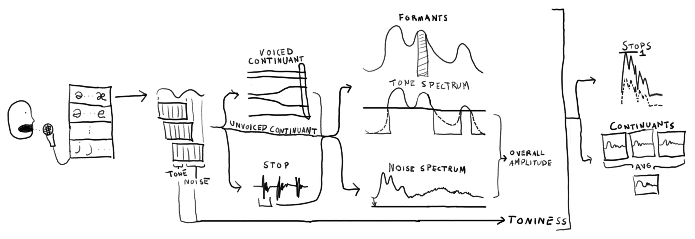
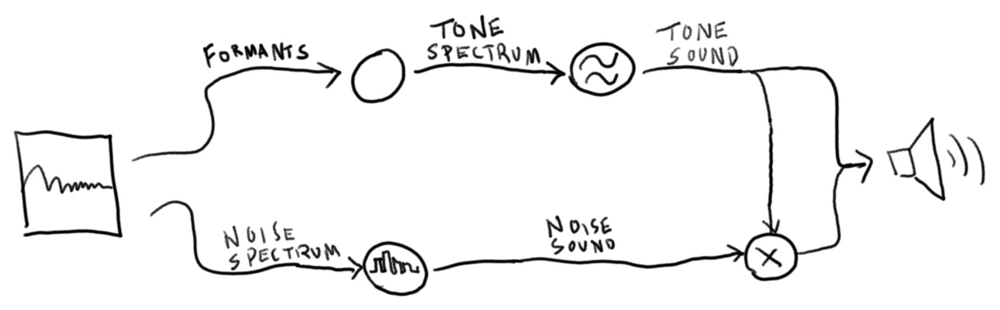

dlal's approach to speech synthesis has the following features:
- it learns phonetics from a recording
- it models the vocal tract
- when synthesizing, it takes a tone source, a noise source, and a phonetic as input
- it can synthesize in real time

While the latter three features are common, the first is not. Not only is it cool to be able to create robotic voices based on human voices, it also prevents a kind of overfitting. If we truly understand how speech is synthesized, we should be able to extract parameters automatically.

## intelligibility
dlal's speech synthesis is not yet intelligible. Phonetics can be discerned if the listener can read the spoken sentence at the same time, but the sentence cannot be reliably heard from just the sound. Many ideas on how to improve are in the code and commit log. What is kept here are ideas that either never made it in, aren't fully explored, or just aren't clearly conveyed by their presence in the code and commit log.

### glottal source
Using a glottal source for the tone sounds more natural but doesn't seem more intelligible. Regardless, the system wouldn't live up to its goals if it depended on a glottal source to be intelligible.

### transitions
Switching between vocal tract paramters is done smoothly but simply. Formants are ordered from lowest to highest, and each formant smoothly moves from one individual set of parameters to the next. This helps make glides sound _more_ natural, but in reality only certain formants should morph into each other. For example, in "am", the overall volume is reduced, and resonances in the nose are emphasized. However, the system may morph a vocal tract formant into a nasal one.

So far this doesn't seem to be a big deal, aside from very chaotic changes. For example, if a formant morphs from low to high frequency, it can create an unintentional stop sound.

### filtering
A recording of actual speech has higher formants than the speech synth currently does. While the IIR bank approach offers the power of IIR filters and the flexibility of FIR filters, only single-pole IIR filters are being used.

## architecture
### listing
#### recording
A practical set of English phonetics are recorded. They are recorded according to how they are produced.
- Voiced continuants are recorded following an unstressed vowel sound and slow transition.
- Unvoiced continuants are recorded in isolation.
- Stops are recorded unvoiced, each followed by an unvoiced unstressed vowel sound.
The recordee is encouraged to produce similar recordings, we must handle some amount of variance between recordings. For example one phonetic recording being louder than another.

#### encoding
##### sampling
Overlapping short-time Fourier transforms (STFTs) are taken. The tone and noise energy in the signal are estimated based on bin range and gain factor parameters and converted to amplitudes.

##### modeling
For voiced continuants, formants are tracked from the unstressed vowel portion of the recording, and then measured. This helps ensure formants are not accidentally shuffled. The phonetic is then parameterized and framed.

For unvoiced continuants, the phonetic is immediately parameterized and framed.

For stops (which are recorded unvoiced), the first single utterance of the stop is taken. The start and end are found based on amplitude threshold parameters. The utterance is parameterized and framed.

###### parameterization
For voiced phonetics, formant frequencies and amplitudes are estimated. The amplitude of the formant is calculated based on the energy of the peak, with a parameter for how much of the peak to consider. The tone spectrum is estimated by taking bins above a threshold parameter.

The low end of the spectrum is discarded according to a threshold parameter. Based on this we estimate the center frequency of noise and the high noise component. The center frequency is an amplitude-based weighted average. The high noise is the energy in the signal above a frequency threshold parameter divided by the total energy of the signal.

The noise spectrum is estimated as the original signal's spectrum, with the first bin zeroed.

An overall amplitude is calculated from the tone and noise spectra.

The ratio between tone amplitude and total amplitude is calculated.

###### framing
Continuant parameters are averaged to produce a final result, rejecting outliers in the case of formant frequencies. The overall amplitude is set to 1.

Stop parameters are kept in a sequence. Their overall amplitudes are normalized so that every stop peaks at 1.

#### decoding
A sequence of phonetics (or syllables), timings (or notes), and pitches (or notes) are taken as input. Some phonetic rules are applied, such as ensuring silence before each stop, and how syllables should stretch or shrink in time.

Each phonetic is synthesized. Continuants have only one frame that is played continuously; stop frames are synthesized sequentially.

Formants are sent to a component that smoothly transitions between them, producing a spectrum each run, and fed to an additive sin bank synthesizer. The noise spectrum is fed to an additive noise bank synthesizer.

The noise signal is multiplied by the tone signal in such a way that voiced fricatives buzz and unvoiced fricatives are not silent.

The noise signal is multiplied by a tunable parameter.

#### vocoding
An input signal is parameterized and the result is directly synthesized.
